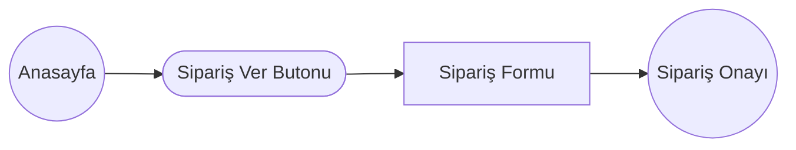
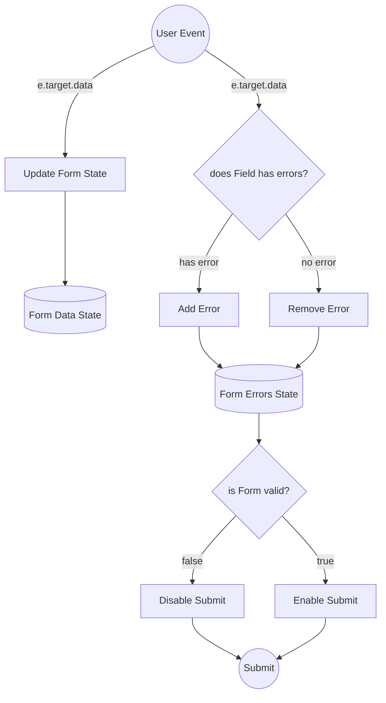

# Sprint Challenge: _Teknolojik Yemekler - SPA_

SPA: Single Page Application

## Proje Açıklaması

Bu challenge, geçmiş sprint boyunca öğrenilen kavramları ve teknikleri uygulamana ve bunları somut bir projede kullanmanı sağlayacak. Bu sprintte **tek sayfa uygulamalarını** (SPA) keşfettin. Sprint boyunca, **routing, formlar, ve cypress testlerini** öğrendin. Challenge skorun, bu sprint boyunca işlenen materyali kullanarak bağımsız çalışma yapabilme yeteneğinin bir göstergesi olacak. Bu projeyi de ödevlerdeki gibi tek başına yapacaksın.

S8 içinde de Workintech eğitmenlerine, adeta bir teknik mülakattaymış gibi, bu projeyi sunmanı istiyoruz.
- Bu sunumda, _1 dk_ içerisinde, CSS'e döktüğün arayüz; 3dk içinde geliştirdiğin React veri akışını anlatacaksın. İlk önce arayüzde nasıl bir kullanıcı deneyimi sunduğunu kısaca özetleyip, sonra altta kodların nasıl çalıştığını, nasıl bir veri akışı kurduğunu, açık bir şekilde ifade edebilmelisin.

> Kısaca: 4 dk içinde, önce arayüzü anlatıp, sonra kodun nasıl
> çalıştığını ifade edebilmelisin. Zaman kullanımı ve sunum tekniğin de değerlendirme kriterlerinde yer alıyor. Öncesinde, kendini videoya çekerek, sunum pratiği yapabilirsin.

### Temsili Veri Akış Diagramları

#### Routes



#### Sipariş Formu Veri Akışı



## Talimatlar

Bu sprint challenge'ında, bilgisayar başında karnı acıkan yazılımcılara yiyecek getirmek için tasarlanmış bir web sitesi **Teknolojik Yemekler**' markasına, _Anasayfa_, _Sipariş Formu_ ve _Sipariş Alındı_ sayfası oluşturarak bu konulardaki ustalığınızı göstereceksin.  


## Aşama 1: Proje Kurulumu ve İterasyon 1

### Görev 1: Proje Kurulumu

- [ ] Forklayarak bir kopya oluşturun
- [ ] Forku klonlayın
- [ ] Main branch üzerinde çalışın
- [ ] Comitinizi pushlayın: `git push origin main`
- [ ] Farklı paketler kullanmaya çalışın.

### Görev 2: Proje Planını, UI Tasarımı ve Diğer Tasarım Öğelerini İncelemek

Zamanı verimli kullanmak için aşağıdaki sırayla geliştirme yapmanı tavsiye ediyoruz.

1.  [Sipariş Formu](./Interfaces/Iteration-1/OrderPizza.png)
2.  [Anasayfa](./Interfaces/Iteration-1/Home.png)
3.  [Sipariş Onayı](./Interfaces/Iteration-1/Success.png)

#### Renk Kodları

1. Sarı #FDC913 
2. Açık Gri: #5F5F5F 
3. Koyu Gri #292929 
4. Kırmızı #CE2829
5. Bej: #FAF7F2

#### Tasarımda Kullanılan Fontlar

Logo proje klasöründe SVG olarak yüklü

- [Roboto Condensed](https://fonts.google.com/specimen/Roboto+Condensed)
- [Barlow](https://fonts.google.com/specimen/Barlow)
- [Quattrocento](https://fonts.google.com/specimen/Quattrocento)
- [Satisfy](https://fonts.google.com/specimen/Satisfy)

### Görev 3: IT1 Proje Gereklilikleri

IT1 aşamasına getirdiğiniz (minimum viable product), aşağıdaki gereksinimlerin hepsini sağlamalıdır.

- [ ] Hero alanındaki buton ile forma linklenen bir anasayfa.
- [ ] Bir sipariş formu
- [ ] En az 3 karakter gerektiren bir isim inputu. (İsim alanı tasarımda yok olabilir. Form'da notlar alanının üzerine ekleyebilirsin)
- [ ] Malzemeler için bir çoklu seçim - en az 4 adet ve en fazla 10 adet seçim yapılmalı (Tasarımda yine eksik gösterilmiş)
- [ ] Pizza boyutunun seçilebileceği bir radio
- [ ] Notlar için ek bir text area
- [ ] "Sipariş Ver" butonuna tıklandığında, sanki bir sunucuya veri gönderip, yanıt almış gibi davranmalı. Formda eksik bilgi veya hata varsa form disabled olmalı. (hem html hem submit fonksiyonundan gönderim engellenmeli)
- [ ] Submit edince, Axios ile API request sonrası console'a gelen yanıtı basmalısın. [https://reqres.in/api/pizza](https://reqres.in/api/pizza)  ücretsiz bir mock api servisine, `axios` ile POST ile kendi datanızı attığınızda, size sanki veritabanına kaydedilmiş gibi id ve tarih ekleyip aynı veriyi geri döner. (SONRASINDA GET ATMIYORUZ)
- [ ] Bu yanıtı gelen response'u, sipariş özeti console'a yazmalı.

Not - Form'un payloadu, veri **örnek olarak** şu şekilde olabilir. **Kendiniz de bu yapıyı değiştirebilirsiniz.**

```
{
    isim: string,
    boyut: string,
    malzemeler: [malzeme1, malzeme2, malzeme3, ...]
    özel: string,
	(gerekli diğer alanlar)
}
```

veya

```
{
    isim: string,
    boyut: string,
    malzeme1: bool,
    malzeme2: bool,
    m...
    özel: string,
	(gerekli diğer alanlar)
}
```

iştir. Veri yönetiminde doğru akışı ve adımları eksiksiz ifade edebilmiştir. 

  - **3 Gereksinimleri Aşıyor:**
    - Doğru yanıta ek, en az bir başka çözüm ile de daha geniş perspektiftan yanıtlayabilme, ikisi arasındaki benzerlik ve uygulama farklarını karşılaştırabilmek.
